# Entry Map Enrichment — Validation & Playtest Report

Branch: `feat/entry-map-enrichment`
Date: 2026-06-19

## Automated validation

| Gate | Command | Result |
|---|---|---|
| Unit suite | `bun run test:unit -- --run` | ✅ 579/579 passing (40 files) |
| Typecheck | `bun run check` | ✅ 0 errors, 0 warnings (451 files) |
| Lint | `bun run lint` | ✅ prettier + eslint clean |
| e2e | `bun run test:e2e` | ✅ (re-run at Phase 5) |
| Save compat | `bun run test:unit -- --run src/lib/game/save/save-state.test.ts` | ✅ fresh save → `seenDiscoveries: []`; migration covered |

### Follow-up-plan work landed this pass

- **Phase 1 — route-interest test rigor.** Replaced the weak `.some()` route check with
  `worstEmptyGapAlongSegment` (max continuous empty stretch, `step 256 / radius 650 / gap ≤ 700`),
  reporting the route name and the empty point. `interestPoints` now also counts manifest-referenced
  decor / ground patches as breadcrumbs. The stricter test caught a real **1536px dead stretch on the
  wildwood climb** that the old test passed; recording `wildwood-staging-brush` as an approach clue
  closed it. Mutation-verified: removing `wildwood-staging-brush` or `crossroads-cache` turns a test red.
- **Phase 2 — structural lock-in.** The completeness test now requires every region to declare an
  optional branch (side pocket) and a **non-landmark** payoff. The route content itself was already
  landed by prior commits; the strict test confirms all five routes are covered.
- **Phase 3 — marker noise.** World discovery markers now reveal only within ~240px of the hero
  (`discoveryRevealRadius`), so a normal camera view never shows a cluster of pulses.

## Human playtest (in-app capture)

Method: launched `bun run dev`, drove the live game through Chrome DevTools, and captured the five
routes plus both sealed gates. Findings below are visual-composition observations from these captures
(not stopwatch-timed). Screenshots live in [`./entry-map-playtest/`](./entry-map-playtest/).

### Route 1: Spawn → Crossroads

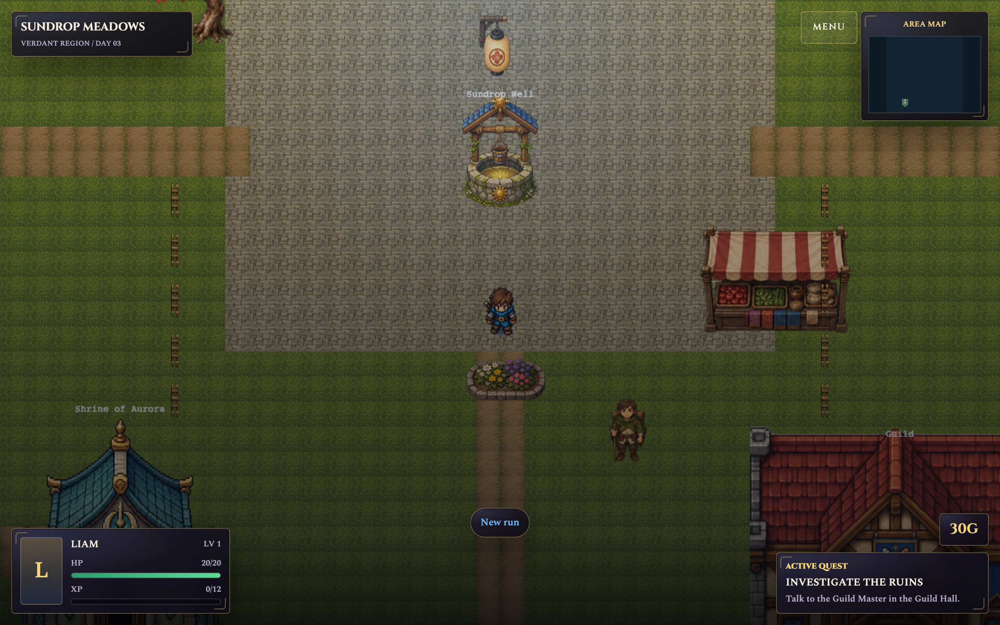
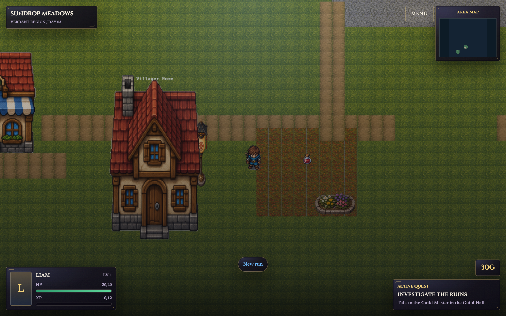
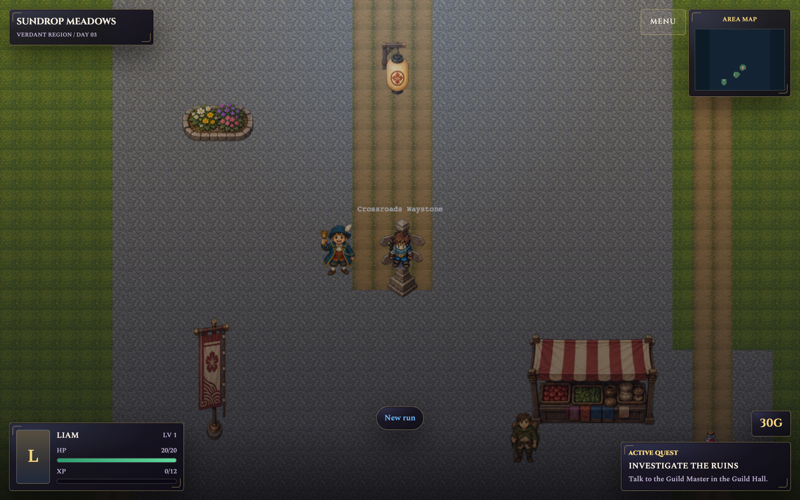

- First visible hook: immediate — well, market stall, traveler NPC, flower bed and an examinable
  prompt are all on screen at spawn.
- First route choice: the roadside rest-stop — a dirt ground-patch nook that bulges off the lane.
- First payoff: `village-roadside-cache` (field potion) sits **on the nook, off the lane**, not on the road.
- Longest empty-feeling walk: none; breadcrumbs (waymarker lantern → flowers → cache → houses) are dense.
- Confusing collision: none observed.
- Hub: the Crossroads reads as a real hub — central waystone, festival banner over the north (castle)
  road, market stall + traveler, and cobblestone lanes radiating to multiple regions.

### Route 2: Crossroads → Coast → Jetty → Tidepool

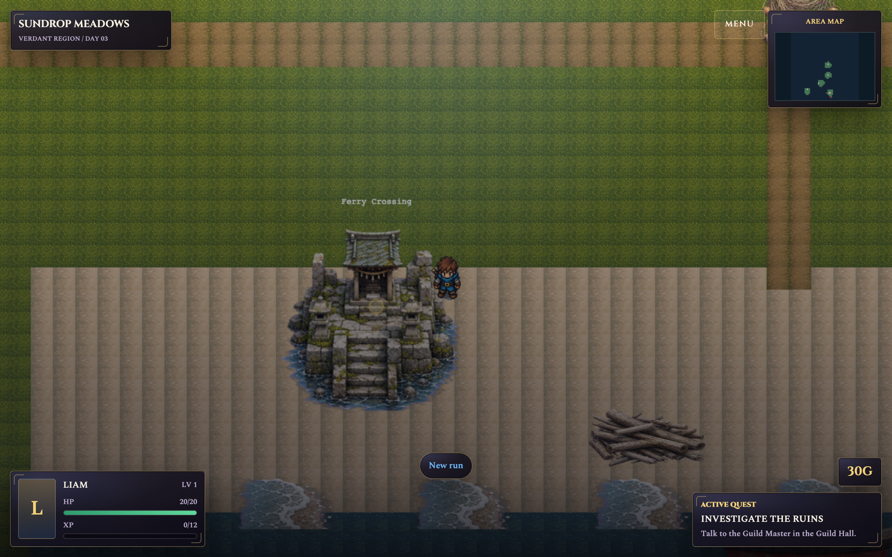
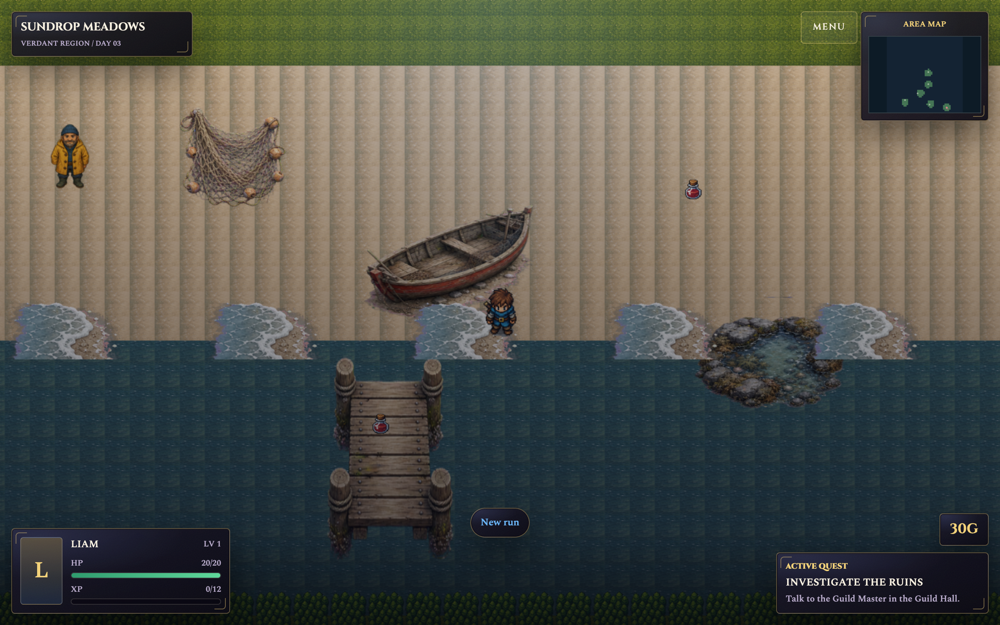

- First hook: the Ferry Crossing shrine on the sand, with driftwood and a beached rowboat.
- Three nodes present: **ferry shrine** (readable from the front), **tidepool** (foamy pool, east),
  and **jetty** (pier). Distinct nodes, real fork between shrine-first and shore-first.
- Payoff off the road: `coast-salve` by the net/boat and a pickup at the **end of the jetty planks**.
- Confusing collision / false-interactive: none observed; fisherman NPC clearly reads as a character.

### Route 3: Crossroads → Mistfen → Witchwood Gate

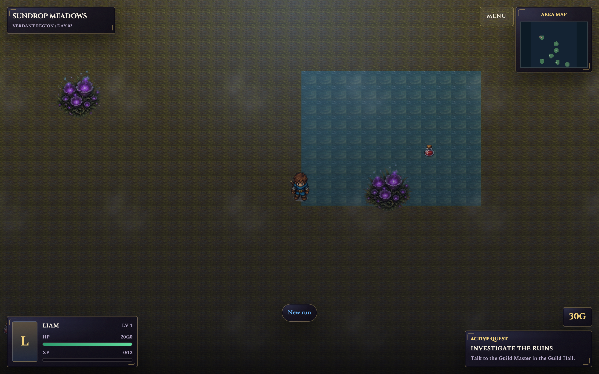
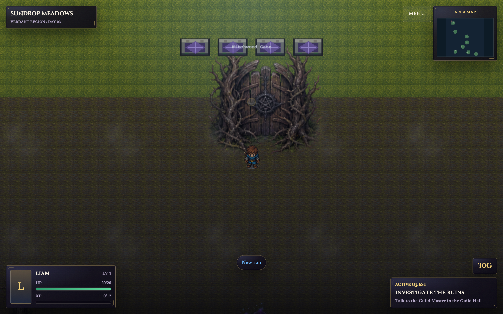

- First hook: toxic blooms and a marsh pool under noticeably dimmer, eerier lighting.
- Side pocket: the **east pool** holds the `mistfen-salve` reward off the safe approach.
- Gate foreshadowed: the Witchwood Gate is a gnarled dead-tree gate fronted by a dark fog band.
- Quiet but not empty; mood lands well.

### Route 4: Crossroads → Silverpine → Shrine Gate

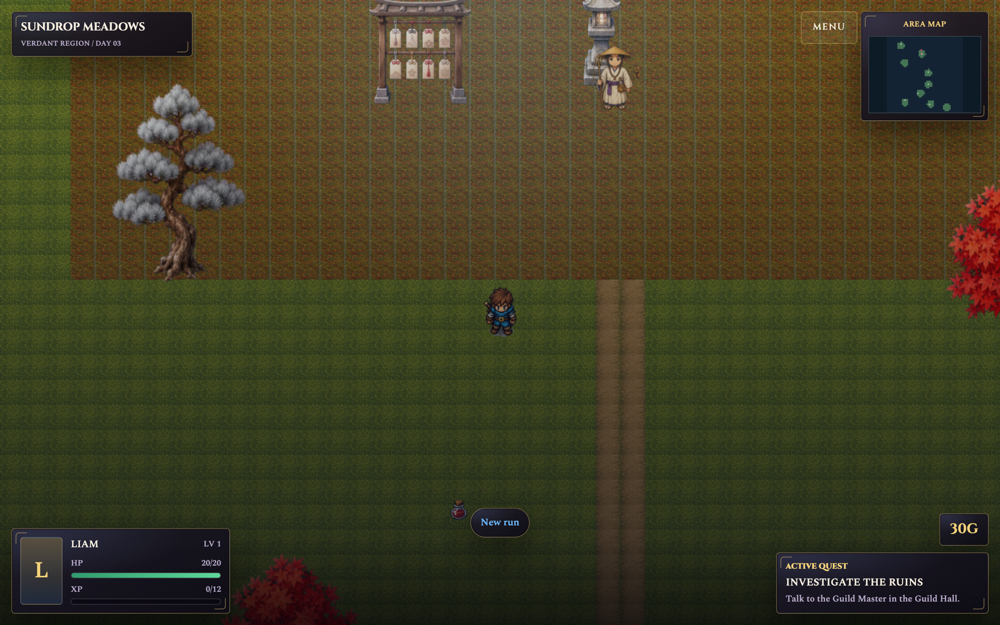
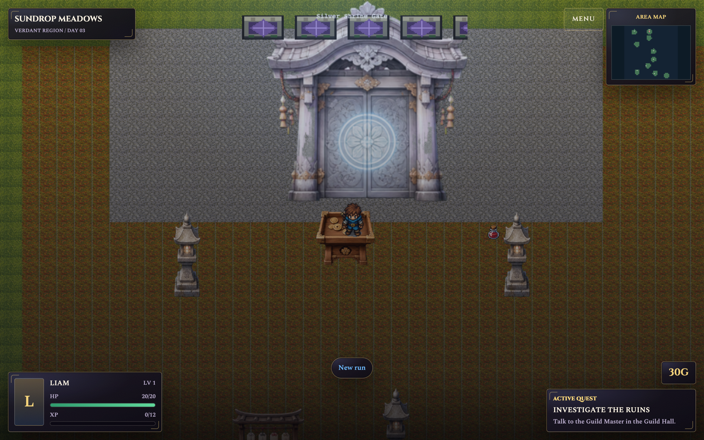

- First hook: an offering archway, a stone lantern, and a pilgrim NPC facing uphill.
- Reads as an ascent: lantern cadence + pilgrim + silver tree / autumn maples flanking the climbing path.
- Side grove / offering nook with the `silverpine-tonic` reward off the direct path.
- Shrine gate: a glowing silver gate on a **wider, calmer terrace** than the approach — the reveal feels earned.

### Route 5: Crossroads → Wildwood → Whispering Cave

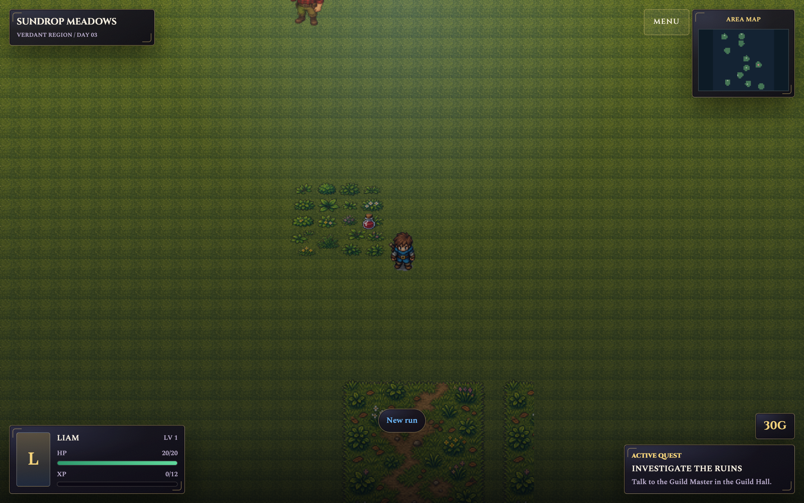
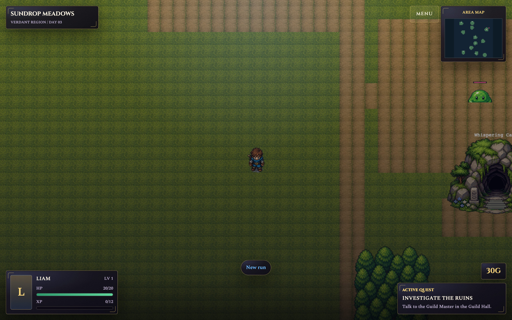

- First hook: the forest road and the woodcutter NPC; darker forest floor.
- Side pocket: `wildwood-grove-cache` tucked into brush, spatially off the main route.
- Danger pacing: a slime is visible **ahead of** the Whispering Cave, so the player sees danger before
  combat; the cave mouth carries its warning discovery and the canopy narrows toward it.

### Discovery markers (Phase 3)

- Verified in-app: at the Crossroads only the **waystone** marker pulsed; the Castle Gate marker (~980px
  north) stayed hidden. Near the Whispering Cave its marker pulsed in. No cluster of pulses in a normal view.
- Discoveries remain findable — the marker fades in as the hero approaches (~240px).

## Three weakest remaining areas (deferred — cosmetic only)

All five routes pass the stricter route-interest test, so none of these is an empty route; they are
visual-polish notes deliberately deferred this pass to honor the "stop expanding" guidance.

1. **Village rest-stop composition** — the nook's ground patch is large relative to its few props, and the
   waymarker lantern is offset enough to be easy to miss as the approach clue. Tighten spacing later.
2. **Mistfen path readability** — the eerie mood is strong, but the intended marsh S-curve is subtle and
   the east-pool reward sits fairly exposed. A few more reeds/rocks would sharpen the route shape.
3. **Wildwood grove cover** — the hidden cache reads as only lightly screened by brush; denser tree/brush
   cover would better sell it as a discovered secret.

## Conclusion

The five routes each deliver the visible-hook → route-choice → payoff → next-hook loop, both sealed gates
read as future destinations, and marker noise is resolved. Remaining items are cosmetic and deferred.
