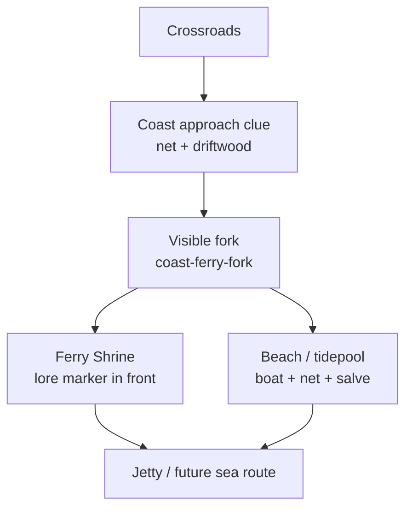

# Entry Map Route-Scene Playtest

Branch: `feat/entry-map-enrichment`
Date: 2026-06-20

Status: Coast-first implementation slice. This report updates the proof trail for Phase 0 through the
Crossroads -> Coast golden route. The remaining route redesign phases are intentionally deferred until the
Coast route is reviewed.

Screenshots: [`./entry-map-playtest-reviewed/`](./entry-map-playtest-reviewed/)

## Coast Route Diagram

## Route: Spawn -> Crossroads

Before screenshot: [02-village-reststop.png](./entry-map-playtest-reviewed/02-village-reststop.png)

After screenshot: Deferred; no geometry change in this slice.

Question 1: What is the first thing that pulls your eye?
Answer: Village density: well, road, nearby buildings, and roadside dressing.

Question 2: Where is the first route choice?
Answer: The roadside nook near the village-to-crossroads link.

Question 3: What reward did you choose to detour for?
Answer: `village-roadside-cache`.

Question 4: What story motif did the route communicate?
Answer: Homeward road, but the motif depends on small waymarker props.

Question 5: What still felt empty or samey?
Answer: No new finding for this slice; stronger repeated road-home cues remain future polish.

Patch applied after playtest: None.

## Route: Crossroads -> Coast

Before screenshot: [before Ferry Shrine](./entry-map-playtest-reviewed/before-05-coast-ferry-shrine.png),
[before jetty/tidepool](./entry-map-playtest-reviewed/before-06-coast-jetty-tidepool.png)

After screenshot: [new fork](./entry-map-playtest-reviewed/after-04-coast-fork.png),
[Ferry Shrine front](./entry-map-playtest-reviewed/after-05-coast-ferry-shrine.png),
[jetty/tidepool](./entry-map-playtest-reviewed/after-06-coast-jetty-tidepool.png)

Question 1: What is the first thing that pulls your eye?
Answer: The approach now lands on a horizontal sand fork with driftwood and a fisherman, not just a vertical road.

Question 2: Where is the first route choice?
Answer: `coast-ferry-fork`; the player can branch left to Ferry Shrine or continue toward the shoreline.

Question 3: What reward did you choose to detour for?
Answer: `coast-salve` is now beside the tidepool/boat/net cluster, while `coast-jetty-catch` sits off the jetty's center.

Question 4: What story motif did the route communicate?
Answer: Ferry crossing and future sea route: shrine, torii sightline, net, boat, tidepool, and jetty all stay in the same route language.

Question 5: What still felt empty or samey?
Answer: The sand band is still broad, but the route no longer reads as one straight descent to a decorated beach.

Patch applied after playtest:

- Added `coast-ferry-fork` and `coast-shrine-landing` ground patches.
- Moved `ferry-shrine-lore` in front of the shrine collision so it reads as examinable from the approach.
- Reclustered boat/net/tidepool around `coast-salve` and moved `coast-jetty-catch` off the central planks.

## Route: Crossroads -> Mistfen

Before screenshot: [07-mistfen-marsh.png](./entry-map-playtest-reviewed/07-mistfen-marsh.png)

After screenshot: Deferred; no geometry change in this slice.

Question 1: What is the first thing that pulls your eye?
Answer: Fog, toxic bloom, marsh water, and the forager warning.

Question 2: Where is the first route choice?
Answer: The east-pool pocket.

Question 3: What reward did you choose to detour for?
Answer: `mistfen-salve` / `mistfen-cache`, depending on approach angle.

Question 4: What story motif did the route communicate?
Answer: Forbidden gate and poison warning.

Question 5: What still felt empty or samey?
Answer: The S-curve is too subtle and the side reward remains too exposed.

Patch applied after playtest: Deferred to Mistfen phase so this slice stays Coast-focused.

## Route: Crossroads -> Silverpine

Before screenshot: [09-silverpine-climb.png](./entry-map-playtest-reviewed/09-silverpine-climb.png)

After screenshot: Deferred; no geometry change in this slice.

Question 1: What is the first thing that pulls your eye?
Answer: Lanterns, pilgrim, and shrine dressing.

Question 2: Where is the first route choice?
Answer: The grove/offering side area.

Question 3: What reward did you choose to detour for?
Answer: `silverpine-tonic` or the offering cache, depending on path.

Question 4: What story motif did the route communicate?
Answer: Shrine ascent and sealed threshold.

Question 5: What still felt empty or samey?
Answer: The route is still mostly straight; the ascent needs stronger bends or steps.

Patch applied after playtest: Deferred to Silverpine phase.

## Route: Crossroads -> Wildwood

Before screenshot: [11-wildwood-grove.png](./entry-map-playtest-reviewed/11-wildwood-grove.png),
[12-wildwood-danger-approach.png](./entry-map-playtest-reviewed/12-wildwood-danger-approach.png)

After screenshot: Deferred; no geometry change in this slice.

Question 1: What is the first thing that pulls your eye?
Answer: Forest threshold, woodcutter, and darker forest-floor dressing.

Question 2: Where is the first route choice?
Answer: The side grove near `wildwood-grove-cache`.

Question 3: What reward did you choose to detour for?
Answer: `wildwood-grove-cache`.

Question 4: What story motif did the route communicate?
Answer: Forest danger and forbidden cave threshold.

Question 5: What still felt empty or samey?
Answer: The side cache is only lightly screened, so it reads less secret than intended.

Patch applied after playtest: Deferred to Wildwood phase.

## Deferred Issues

1. Mistfen needs a stronger S-curve and hidden side-pocket reward. Deferred because Coast is the plan's golden-route gate.
2. Silverpine needs path bends/step rhythm. Deferred to avoid changing all routes before Coast review.
3. Wildwood needs a stronger threshold and brush-screened side clearing. Deferred to keep this diff scoped.
