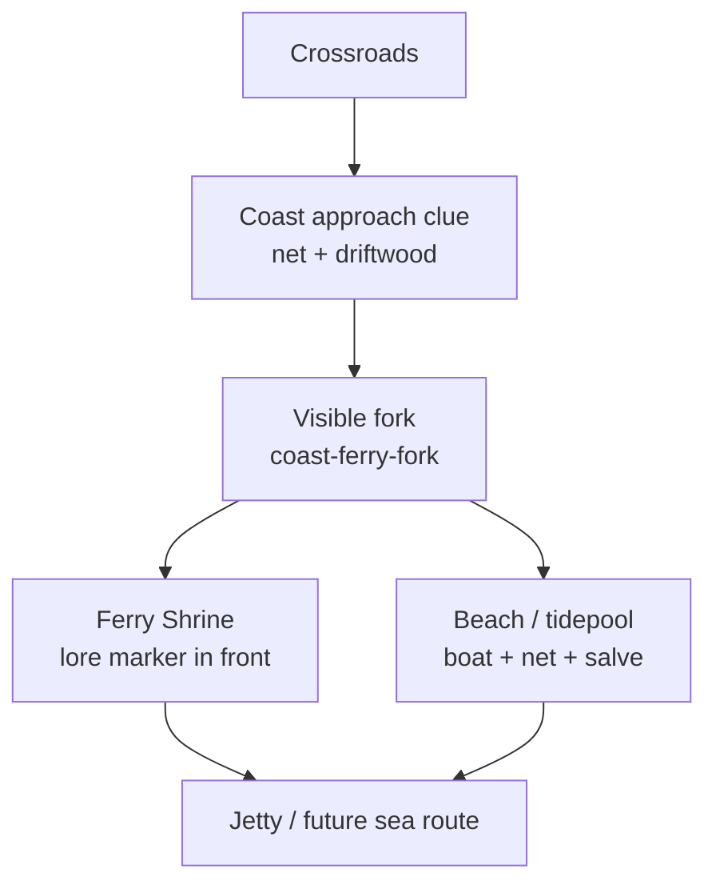

# Entry Map Route-Scene Playtest

Branch: `feat/entry-map-enrichment`
Date: 2026-06-20

Status: full route-scene redesign pass. Screenshots are reviewable in
[`./entry-map-playtest-reviewed/`](./entry-map-playtest-reviewed/).

## Coast Route Diagram

## Route: Spawn -> Crossroads

Before screenshot: [02-village-reststop.png](./entry-map-playtest-reviewed/02-village-reststop.png)

After screenshot: [after-02-village-reststop.png](./entry-map-playtest-reviewed/after-02-village-reststop.png)

Question 1: What is the first thing that pulls your eye?
Answer: Village density, the waymarker, and the off-road cache nook.

Question 2: Where is the first route choice?
Answer: The roadside nook branching off the village-to-crossroads link.

Question 3: What reward did you choose to detour for?
Answer: `village-roadside-cache`.

Question 4: What story motif did the route communicate?
Answer: Homeward road into a named hub.

Question 5: What still felt empty or samey?
Answer: No route-blocking issue found; this route already carried the homeward beat.

Patch applied after playtest: Manifest split the fork and payoff beats so the side nook cannot be counted as
only a generic point of interest.

## Route: Crossroads -> Coast

Before screenshot: [before Ferry Shrine](./entry-map-playtest-reviewed/before-05-coast-ferry-shrine.png),
[before jetty/tidepool](./entry-map-playtest-reviewed/before-06-coast-jetty-tidepool.png)

After screenshot: [new fork](./entry-map-playtest-reviewed/after-04-coast-fork.png),
[Ferry Shrine front](./entry-map-playtest-reviewed/after-05-coast-ferry-shrine.png),
[jetty/tidepool](./entry-map-playtest-reviewed/after-06-coast-jetty-tidepool.png)

Question 1: What is the first thing that pulls your eye?
Answer: The horizontal sand fork with driftwood and fisherman, not a vertical road dropping into a beach.

Question 2: Where is the first route choice?
Answer: `coast-ferry-fork`; the player can branch left to Ferry Shrine or continue toward the shoreline.

Question 3: What reward did you choose to detour for?
Answer: `coast-salve` beside the tidepool/boat/net cluster, plus `coast-jetty-catch` off the jetty center.

Question 4: What story motif did the route communicate?
Answer: Ferry crossing and future sea route.

Question 5: What still felt empty or samey?
Answer: The beach remains broad, but the route no longer reads as one straight descent.

Patch applied after playtest:

- Added `coast-ferry-fork`, `coast-shrine-landing`, and `coast-tidepool-pocket`.
- Moved `ferry-shrine-lore` in front of shrine collision.
- Reclustered tidepool/boat/net/salve and moved `coast-jetty-catch` off-center.

## Route: Crossroads -> Mistfen

Before screenshot: [07-mistfen-marsh.png](./entry-map-playtest-reviewed/07-mistfen-marsh.png),
[08-witchwood-gate.png](./entry-map-playtest-reviewed/08-witchwood-gate.png)

After screenshot: [after-07-mistfen-marsh.png](./entry-map-playtest-reviewed/after-07-mistfen-marsh.png),
[after-08-witchwood-gate.png](./entry-map-playtest-reviewed/after-08-witchwood-gate.png)

Question 1: What is the first thing that pulls your eye?
Answer: The new safe path curve and reed walls, with toxic blooms as danger breadcrumbs.

Question 2: Where is the first route choice?
Answer: `mistfen-hidden-pool-pocket`, screened by `mistfen-reed-wall-east` / `mistfen-reed-wall-west`.

Question 3: What reward did you choose to detour for?
Answer: `mistfen-cache` in the hidden pocket, with `mistfen-salve` still serving the west-side marsh detour.

Question 4: What story motif did the route communicate?
Answer: Forbidden gate and poison warning, strengthened by denser fog near Witchwood Gate.

Question 5: What still felt empty or samey?
Answer: The route is still intentionally quiet, but it now has a visible S-curve rather than a flat basin.

Patch applied after playtest:

- Added `mistfen-safe-curve-a`, `mistfen-safe-curve-b`, and `mistfen-hidden-pool-pocket`.
- Added reed walls, `mistfen-deadfall-bend`, and entry/middle/gate fog layers.
- Moved `mistfen-cache` into the pocket.

## Route: Crossroads -> Silverpine

Before screenshot: [09-silverpine-climb.png](./entry-map-playtest-reviewed/09-silverpine-climb.png),
[10-silverpine-shrine-gate.png](./entry-map-playtest-reviewed/10-silverpine-shrine-gate.png)

After screenshot: [after-09-silverpine-climb.png](./entry-map-playtest-reviewed/after-09-silverpine-climb.png),
[after-10-silverpine-shrine-gate.png](./entry-map-playtest-reviewed/after-10-silverpine-shrine-gate.png)

Question 1: What is the first thing that pulls your eye?
Answer: The path now bends through an autumn side grove before the wide shrine terrace.

Question 2: Where is the first route choice?
Answer: `silverpine-side-grove-floor`, visible from the bent ascent.

Question 3: What reward did you choose to detour for?
Answer: `silverpine-tonic` in the side grove, with `silverpine-offering-cache` on the shrine terrace.

Question 4: What story motif did the route communicate?
Answer: Ceremonial shrine ascent and sealed threshold.

Question 5: What still felt empty or samey?
Answer: No functional gap found; the grove is now deliberately pronounced so it reads in one camera.

Patch applied after playtest:

- Added lower approach, west/east bend patches, terrace landing, and side grove floor.
- Added side-grove maple/pine framing.
- Moved `silverpine-tonic` and pilgrim into stronger ascent composition.

## Route: Crossroads -> Wildwood

Before screenshot: [11-wildwood-grove.png](./entry-map-playtest-reviewed/11-wildwood-grove.png),
[12-wildwood-danger-approach.png](./entry-map-playtest-reviewed/12-wildwood-danger-approach.png)

After screenshot: [after-11-wildwood-threshold-grove.png](./entry-map-playtest-reviewed/after-11-wildwood-threshold-grove.png),
[after-12-wildwood-danger-approach.png](./entry-map-playtest-reviewed/after-12-wildwood-danger-approach.png)

Question 1: What is the first thing that pulls your eye?
Answer: The forest threshold: darker floor, brush on both sides, and the woodcutter at the entry.

Question 2: Where is the first route choice?
Answer: `wildwood-side-clearing`, screened by brush/tree cover before the combat climb.

Question 3: What reward did you choose to detour for?
Answer: `wildwood-grove-cache`, now visually tucked behind `wildwood-cache-brush-screen` and tree cover.

Question 4: What story motif did the route communicate?
Answer: Forest danger escalating into the sealed cave threshold.

Question 5: What still felt empty or samey?
Answer: No remaining macro-route gap found; cave approach has visible danger and heavier canopy.

Patch applied after playtest:

- Added `wildwood-threshold-floor`, threshold brush, and moved the woodcutter to the threshold.
- Added `wildwood-side-clearing`, cache brush screen, and tree cover.
- Added cave warning floor and heavier cave canopy while preserving slime encounter IDs and the ruins transition.

## Crossroads Center

Screenshot: [after-03-crossroads-hub.png](./entry-map-playtest-reviewed/after-03-crossroads-hub.png)

Patch applied after playtest:

- Added directional motif clusters for coast, mistfen, silverpine, and wildwood exits.
- Added `crossroads-white-line` before Castle Gate to imply a sealed future route with existing tiles.
- Kept market-stall nook readable and optional.

## Deferred Issue

No new art was added. A dedicated bell or white-line asset would improve the story motif, but it is deferred
because this plan explicitly reuses existing primitives and avoids new art/systems. The current pass
approximates that motif with existing terrain and shrine/crossroads dressing.
