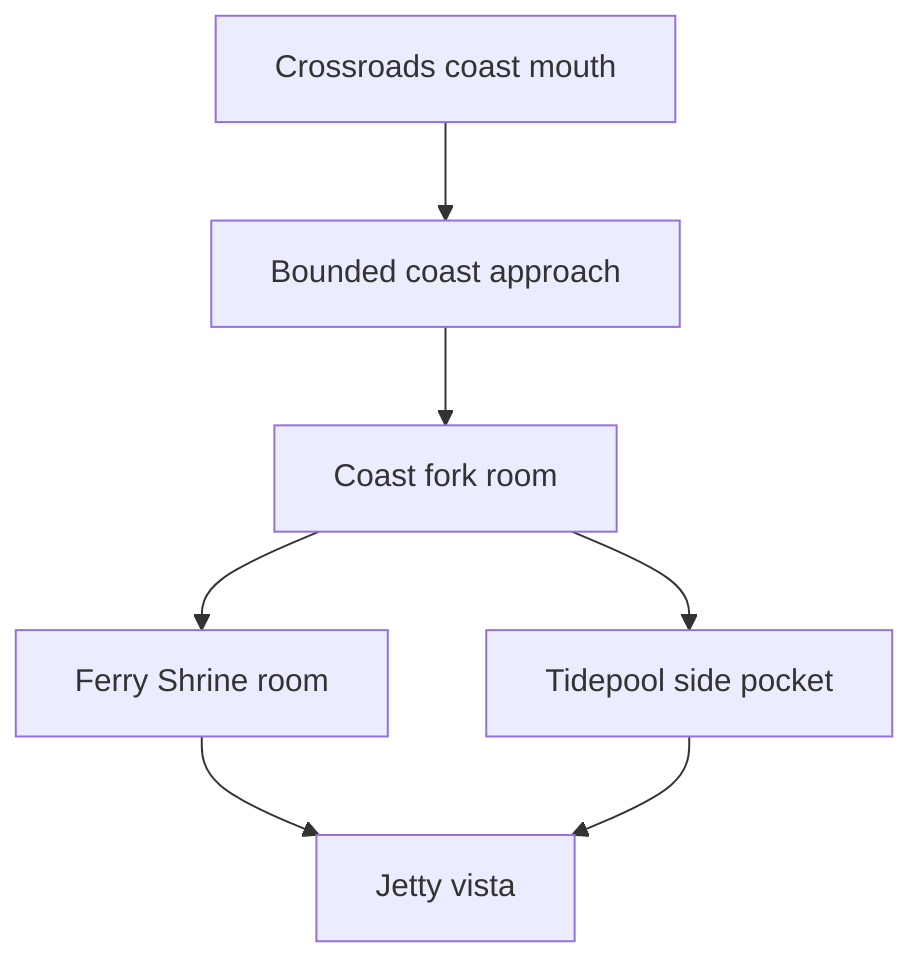

# Entry Map Soft-Maze Playtest

Date: 2026-06-20

Scope: reviewer-plan pass for the `meadow-entry` soft-maze redesign. This pass keeps the existing
runtime model and adds physical route edges, named room/corridor design manifests, decor-role tests,
and reviewable screenshots.

Reviewable after screenshots live in
[`./entry-map-soft-maze-screenshots/`](./entry-map-soft-maze-screenshots/). The before links point to
the previous route-scene screenshot set in
[`./entry-map-playtest-reviewed/`](./entry-map-playtest-reviewed/).

## Manual Walkability Review

Can I cut across open fields?
: Major routes are now physically framed by fences, hedges, reed/pool blockers, tree walls, and
colliding decor. Cross-map grass still exists as background, but the authored route cameras no longer
read as naked path strips.

Does every road have edges?
: Yes for the tested route corridors: village lane, coast approach/fork, Mistfen reed corridor,
Silverpine lower/switchback, and Wildwood forest/combat lanes all have collision-supported boundary
ids in `softMazeCorridors`.

Are side pockets physically legible?
: Yes. Village rest stop, Coast tidepool, Mistfen pool pocket, Silverpine offering grove, and Wildwood
side clearing each have room bounds and payoff ids.

Can I see future destinations before reaching them?
: Castle Gate, Ferry Shrine/jetty, Witchwood Gate, Silver Shrine Gate, and Whispering Cave remain
visible before their blockers or gate interactions.

Are corridors pleasantly maze-like or annoying?
: Current corridors are broad enough for movement but visually bounded. The strongest reads are
Wildwood and Mistfen; Coast is still intentionally wider because it is the vista route.

## Route: Spawn -> Crossroads

Before screenshot: [after-01-spawn.png](./entry-map-playtest-reviewed/after-01-spawn.png),
[after-02-village-reststop.png](./entry-map-playtest-reviewed/after-02-village-reststop.png)

After screenshot: [after-01-spawn-fenced-road.png](./entry-map-soft-maze-screenshots/after-01-spawn-fenced-road.png)

Question 1: What is the first thing that pulls your eye?
Answer: The fenced rural lane north and east of the village houses.

Question 2: Where is the first route choice?
Answer: The rest-stop bulge off the village road.

Question 3: What reward did you choose to detour for?
Answer: `village-roadside-cache`, now placed at the back of the fenced nook.

Question 4: What story motif did the route communicate?
Answer: Homeward road: a domestic village path becoming a guided road toward the Crossroads.

Question 5: What still felt empty or samey?
Answer: The grass outside the fence still exists, but it reads as field beyond the lane rather than
the route itself.

Patch applied after playtest: Added `village-road-west-fence-*`, `village-road-east-fence-*`, and
`village-reststop-fence`; moved `village-roadside-cache` deeper into the side room.

## Route: Crossroads Hub

Before screenshot: [after-03-crossroads-hub.png](./entry-map-playtest-reviewed/after-03-crossroads-hub.png)

After screenshot: [after-02-crossroads-hub-ring.png](./entry-map-soft-maze-screenshots/after-02-crossroads-hub-ring.png)

Question 1: What is the first thing that pulls your eye?
Answer: The waystone remains central, with the hedge ring and themed exits making it read as the only
large open hub.

Question 2: Where is the first route choice?
Answer: The four exits from the plaza: coast, mistfen, silverpine, and wildwood.

Question 3: What reward did you choose to detour for?
Answer: `crossroads-cache` remains the plaza payoff without forcing the player down a route.

Question 4: What story motif did the route communicate?
Answer: Memory topology and route choice.

Question 5: What still felt empty or samey?
Answer: The Castle white line still uses existing terrain/festival dressing rather than dedicated
white-line art.

Patch applied after playtest: Added west/east hedges plus south and north festival fence boundaries to
make the hub intentionally open rather than accidentally open.

## Route: Crossroads -> Coast

Before screenshots: [after-04-coast-fork.png](./entry-map-playtest-reviewed/after-04-coast-fork.png),
[after-05-coast-ferry-shrine.png](./entry-map-playtest-reviewed/after-05-coast-ferry-shrine.png),
[after-06-coast-jetty-tidepool.png](./entry-map-playtest-reviewed/after-06-coast-jetty-tidepool.png)

After screenshots:
[after-03-coast-approach-corridor.png](./entry-map-soft-maze-screenshots/after-03-coast-approach-corridor.png),
[after-04-coast-fork-room.png](./entry-map-soft-maze-screenshots/after-04-coast-fork-room.png)

Question 1: What is the first thing that pulls your eye?
Answer: The net and driftwood threshold at the coast approach.

Question 2: Where is the first route choice?
Answer: At `coast-ferry-fork`, where the shrine branch and shore/tidepool branch split.

Question 3: What reward did you choose to detour for?
Answer: `coast-salve` in the tidepool pocket, with `coast-jetty-catch` at the vista.

Question 4: What story motif did the route communicate?
Answer: Ferry and route home.

Question 5: What still felt empty or samey?
Answer: Coast is still the broadest route, intentionally, but it now has a bounded approach and fork.

Patch applied after playtest: Added approach fences, driftwood walling, shrine pocket boundary,
tidepool wall, and jetty neck boundary ids.

## Route: Crossroads -> Mistfen

Before screenshots: [after-07-mistfen-marsh.png](./entry-map-playtest-reviewed/after-07-mistfen-marsh.png),
[after-08-witchwood-gate.png](./entry-map-playtest-reviewed/after-08-witchwood-gate.png)

After screenshots:
[after-05-mistfen-reed-corridor.png](./entry-map-soft-maze-screenshots/after-05-mistfen-reed-corridor.png),
[after-06-mistfen-pool-pocket.png](./entry-map-soft-maze-screenshots/after-06-mistfen-pool-pocket.png)

Question 1: What is the first thing that pulls your eye?
Answer: Reed walls and the safe road splitting the dark basin.

Question 2: Where is the first route choice?
Answer: The east pool side pocket beside `mistfen-hidden-pool-pocket`.

Question 3: What reward did you choose to detour for?
Answer: `mistfen-cache`, now moved off the route centerline behind reeds.

Question 4: What story motif did the route communicate?
Answer: Poison memory and forbidden gate.

Question 5: What still felt empty or samey?
Answer: The fog-wall boundary is functional and atmospheric, but bespoke marsh wall art would read
more naturally than existing fog/reed pieces.

Patch applied after playtest: Added pool blockers, north/south reed corridor walls, gate fog/reed
walls, and moved `mistfen-cache` off-route.

## Route: Crossroads -> Silverpine

Before screenshots: [after-09-silverpine-climb.png](./entry-map-playtest-reviewed/after-09-silverpine-climb.png),
[after-10-silverpine-shrine-gate.png](./entry-map-playtest-reviewed/after-10-silverpine-shrine-gate.png)

After screenshots:
[after-07-silverpine-switchback.png](./entry-map-soft-maze-screenshots/after-07-silverpine-switchback.png),
[after-08-silverpine-terrace-gate.png](./entry-map-soft-maze-screenshots/after-08-silverpine-terrace-gate.png)

Question 1: What is the first thing that pulls your eye?
Answer: Shrine trees and lanterns framing the climb.

Question 2: Where is the first route choice?
Answer: The bend into `silverpine-side-grove-floor`.

Question 3: What reward did you choose to detour for?
Answer: `silverpine-tonic` in the offering grove and `silverpine-offering-cache` on the terrace.

Question 4: What story motif did the route communicate?
Answer: Shrine path and ritual threshold.

Question 5: What still felt empty or samey?
Answer: The switchback reads in tests and from local camera positions, but the vertical road could use
stronger stair/height art later.

Patch applied after playtest: Added lower shrine walls, switchback trees, offering-grove wall, and a
terrace boundary.

## Route: Crossroads -> Wildwood

Before screenshots: [after-11-wildwood-threshold-grove.png](./entry-map-playtest-reviewed/after-11-wildwood-threshold-grove.png),
[after-12-wildwood-danger-approach.png](./entry-map-playtest-reviewed/after-12-wildwood-danger-approach.png)

After screenshots:
[after-09-wildwood-forest-lane.png](./entry-map-soft-maze-screenshots/after-09-wildwood-forest-lane.png),
[after-10-wildwood-threshold.png](./entry-map-soft-maze-screenshots/after-10-wildwood-threshold.png),
[after-11-wildwood-combat-neck.png](./entry-map-soft-maze-screenshots/after-11-wildwood-combat-neck.png),
[after-12-wildwood-cave-gate.png](./entry-map-soft-maze-screenshots/after-12-wildwood-cave-gate.png)

Question 1: What is the first thing that pulls your eye?
Answer: Tree walls narrowing the forest road.

Question 2: Where is the first route choice?
Answer: The side clearing that holds `wildwood-grove-cache`.

Question 3: What reward did you choose to detour for?
Answer: `wildwood-grove-cache`, framed by brush and tree cover.

Question 4: What story motif did the route communicate?
Answer: Forest danger and cave truth.

Question 5: What still felt empty or samey?
Answer: The combat/cave approach is stronger, but long north-south forest travel still benefits from
future encounter staging and more authored bends.

Patch applied after playtest: Added forest-lane walls, threshold tree walls, combat-pocket walls, and
cave-neck canopy.

## Tests Added

- `src/lib/game/content/maps/regions/soft-maze.test.ts`
- `src/lib/game/content/maps/regions/rooms.ts`
- `src/lib/game/content/maps/regions/decor-roles.ts`

The new tests verify:

- required room declarations and the Crossroads-only large hub rule
- collision-supported corridor boundaries
- side-pocket payoffs inside rooms and off route centerlines
- gate rooms with visible story motifs
- route-scene threshold and boundary ids
- every outdoor decor object has a design role

## Deferred Issue

The pass still uses existing art for several symbolic boundaries: Castle white line, marsh fog wall,
and Silverpine height/stair cues. Dedicated art would improve readability, but the reviewer plan did
not require new assets and this pass intentionally stayed within existing primitives.
