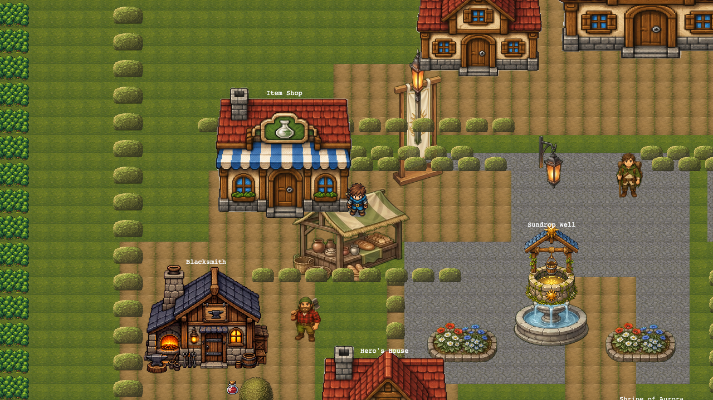
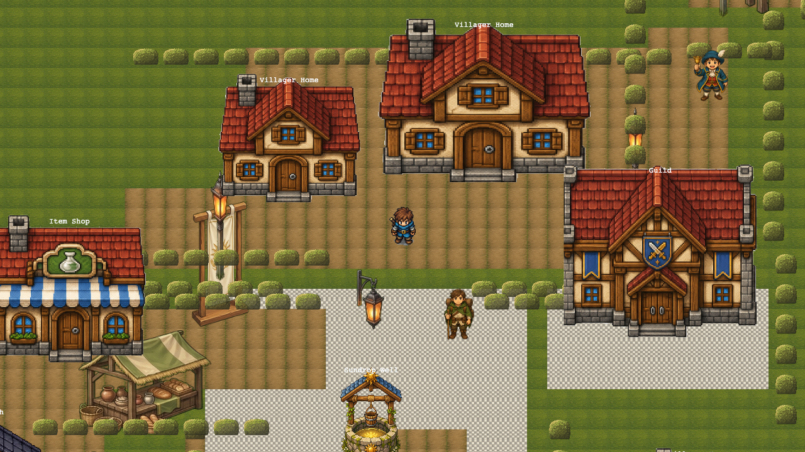
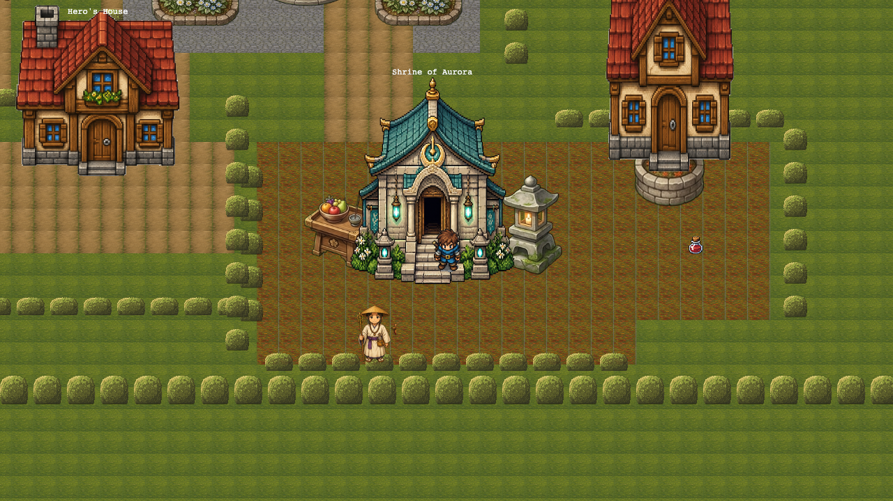
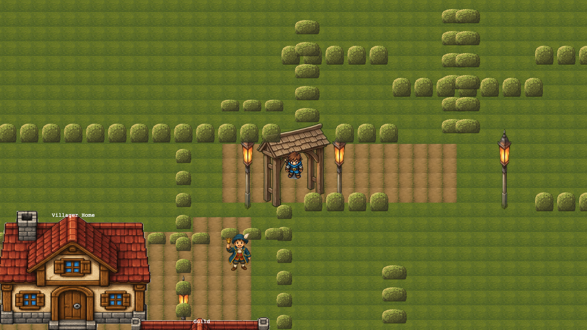
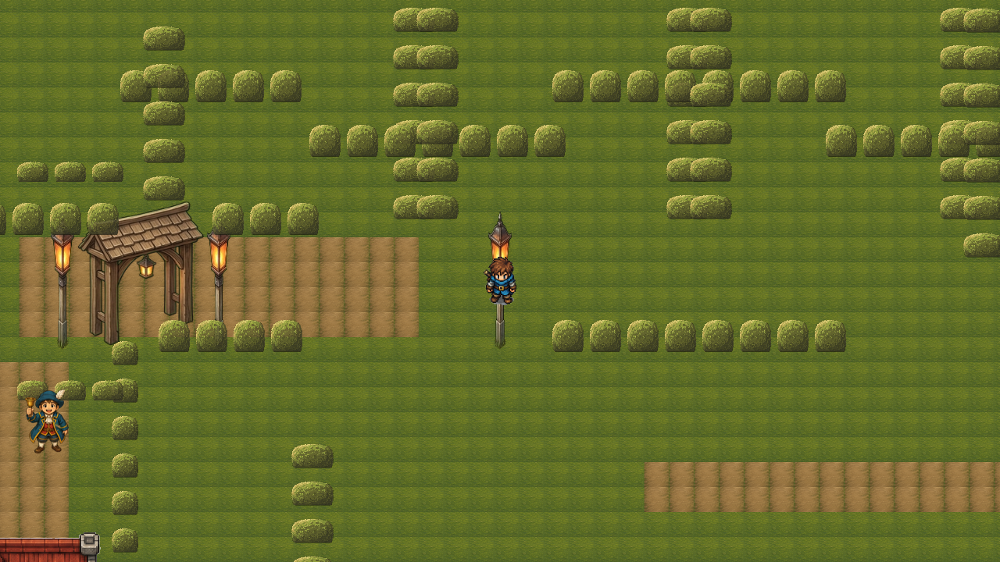

# Sundrop Village Layout Review

## Summary

HPA-115 verifies the deterministic Sundrop Village relayout through committed
canvas screenshots and technical validation. Screenshots were captured from the
built preview app by seeding browser `localStorage` saves at authored village
coordinates, resuming each save, hiding Svelte HUD chrome, and screenshotting the
visible Phaser canvas.

The first screenshot pass exposed a real visual problem: the plaza and guild
forecourt used `plazaStoneTile`, whose asset frame looked like a checkerboard
placeholder in screenshots. The validation branch now changes those two village
patches to the existing `cobblestoneTile` and updates the matching map/scene
test expectations. The refreshed screenshots below use the fixed cobblestone
surface.

## Screenshot Review

### 1. Spawn / Home Yard


- Main anchor: The Hero House and fenced home yard form the start point, with
  the player just below the doorway trigger so the exterior remains visible.
- Available exits: North returns to the Hero House door, northeast leads toward
  the well plaza, and east/southeast points toward the shrine garden edge.
- Optional detour: The field scarecrow and west hedge pocket invite checking the
  left side before returning to the central route.
- Object with no purpose: None observed; the scarecrow, hedges, tree, and nearby
  potion all explain the yard boundary or side reward.
- Hedge-grid feel: No. The hedges act as yard edges, not repeated ring/spoke
  maze cells.

### 2. Well Plaza


- Main anchor: The Sundrop Well sits in the center of a cobblestone plaza and is
  readable as the village hub.
- Available exits: West goes to the market/blacksmith yard, north reaches the
  residences and guild, south returns to the home yard, southeast goes to the
  shrine, and northeast leads to the east gate.
- Optional detour: West toward the market stall and blacksmith is the clearest
  optional branch from the hub.
- Object with no purpose: None observed; flowers, lanterns, NPCs, and buildings
  all identify plaza edges or routes.
- Hedge-grid feel: No. The plaza reads as one open hub with radial exits.

### 3. Market Yard



- Main anchor: The item shop, market stall, and blacksmith together define the
  market/working-yard side room.
- Available exits: East returns to the well plaza, north reaches the residence
  lane, and south/west wrap around the blacksmith side pocket.
- Optional detour: The potion near the blacksmith side teaches the player to
  inspect the left-side yard instead of only following the central route.
- Object with no purpose: None observed; the stall, banner, blacksmith, NPC, and
  reward all serve the market identity or detour.
- Hedge-grid feel: No. The hedges frame the yard and side reward, but the room
  is anchored by buildings and props rather than a technical hedge grid.

### 4. North Residences / Guild



- Main anchor: The two villager houses and Guild building create a clear north
  residential terrace.
- Available exits: South returns to the well plaza, west/southwest leads back to
  the market lane, and east/southeast routes toward the guild forecourt and east
  gate bend.
- Optional detour: The guild forecourt is the main branch, with the larger guild
  facade pulling attention off the direct north lane.
- Object with no purpose: None observed; houses, lanterns, hedges, and the guild
  all identify thresholds or destinations.
- Hedge-grid feel: No. The north area reads as a residential row with a guild
  destination, not a maze.

### 5. Shrine Garden



- Main anchor: The Shrine of Aurora dominates the garden and gives the southeast
  room a distinct identity.
- Available exits: North returns to the plaza, northwest reaches the home-yard
  side, and east points toward the villager-house side pocket.
- Optional detour: The visible salve to the east of the shrine rewards checking
  the garden edge.
- Object with no purpose: None observed; the offering stand, stone lantern,
  pilgrim, maple, and reward all support the shrine room.
- Hedge-grid feel: No. The garden is bounded, but the shrine and maple create a
  themed room rather than a hedge maze.

### 6. East Gate



- Main anchor: The wooden gate arch and paired lanterns mark the village exit.
- Available exits: West returns into the village, south/southwest leads back to
  the guild and plaza, and east opens onto the Crossroads route.
- Optional detour: No local side reward is visible here; this screen is the
  threshold from village to road.
- Object with no purpose: None observed; the gate, lanterns, and crier all
  reinforce the exit.
- Hedge-grid feel: No. The hedges form boundary walls around a gate threshold.

### 7. Route to Crossroads



- Main anchor: The roadside waymarker lantern and nearby gate path establish the
  outbound route.
- Available exits: West returns to the east gate and village, while east/north
  continues along the corridor toward Crossroads.
- Optional detour: No side pocket is authored in this road view; its job is to
  keep the exit route legible.
- Object with no purpose: None observed; hedges and lanterns are route walls and
  breadcrumbs.
- Hedge-grid feel: Mostly no. This is the most corridor-like view, but it reads
  as an exit road bounded by hedges rather than an old village-interior grid.

## Acceptance Criteria

| Criterion | Status | Evidence |
| --- | --- | --- |
| Reviewer can understand the village layout from screenshots alone | Pass | The seven screenshots cover home yard, plaza, market, north/guild, shrine, east gate, and the Crossroads route. |
| Village feels less messy than the previous hedge-grid implementation | Pass | Views are organized around buildings, well, shrine, gate, and route props rather than repeated micro-hedge cells. |
| All village transitions are reachable | Pass | `village-layout.test.ts`, `soft-maze.test.ts`, and `maps.test.ts` all passed after the visual fix. |
| Player can exit village toward Crossroads | Pass | The east-gate and route-to-Crossroads screenshots show the exit road, and e2e validation passed. |
| Full validation passes | Pass | All HPA-115 validation commands passed after rerunning the browser suites unsandboxed where required. |
| Any remaining visual mess is listed with a concrete follow-up patch | Pass | The checkerboard plaza issue was fixed in this branch; no remaining visual mess is listed below. |

## Follow-Up Patches

- None.

## Validation Commands

```sh
rtk bun run test:unit -- --run src/lib/game/content/maps/regions/village-layout.test.ts
# PASS: 1 test file, 17 tests

rtk bun run test:unit -- --run src/lib/game/content/maps/regions/soft-maze.test.ts
# PASS: 1 test file, 3 tests

rtk bun run test:unit -- --run src/lib/game/content/maps.test.ts
# PASS: 1 test file, 66 tests

rtk bun run test:unit -- --run
# PASS: 42 test files, 598 tests

rtk bun run check
# PASS: 0 errors, 0 warnings

rtk bun run lint
# PASS: Prettier and ESLint clean

rtk bun run test:e2e
# PASS: 12 tests
```

## Artifact Check

The screenshot assets are committed under
`docs/superpowers/reports/2026-06-21-sundrop-village-layout-review-assets/`.
Each file is a nonblank `1280x720` PNG:

- `01-spawn-home-yard.png`
- `02-well-plaza.png`
- `03-market-yard.png`
- `04-north-residences-guild.png`
- `05-shrine-garden.png`
- `06-east-gate.png`
- `07-route-to-crossroads.png`
