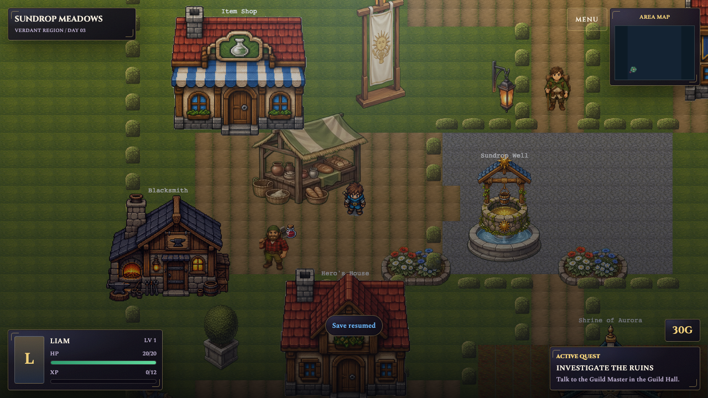
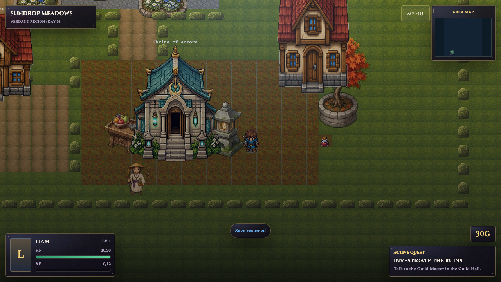
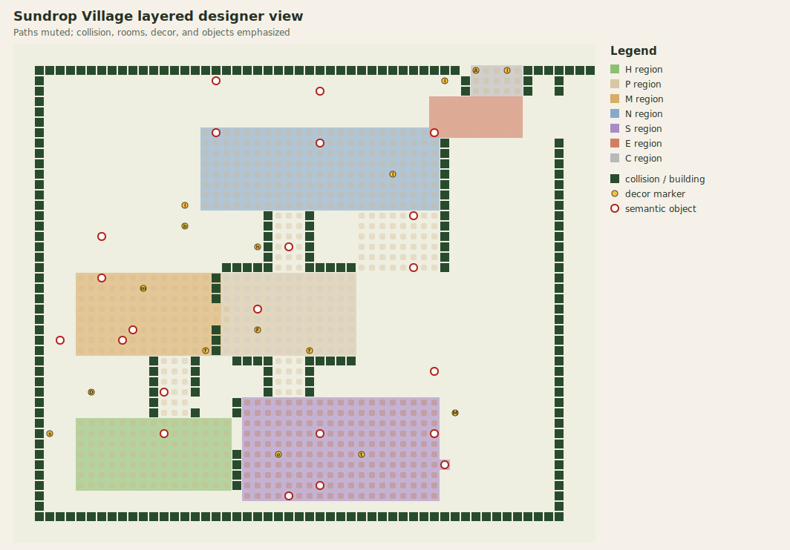
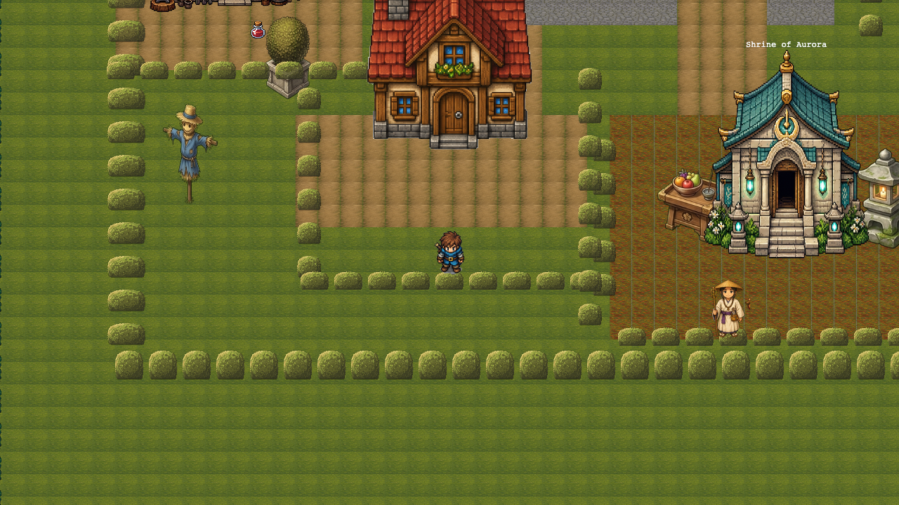
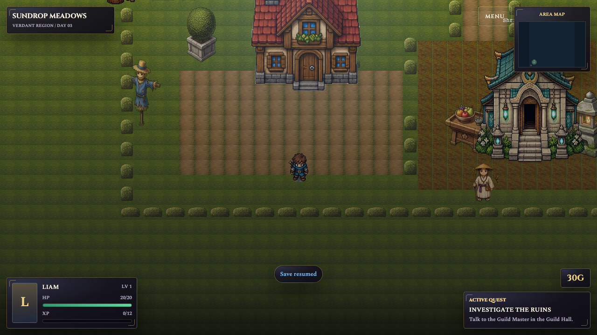
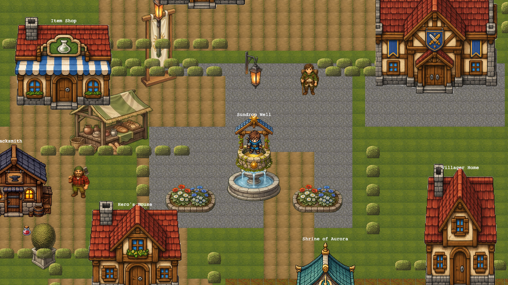
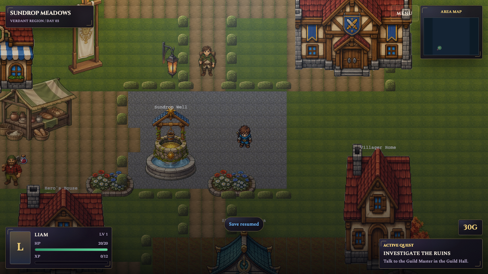
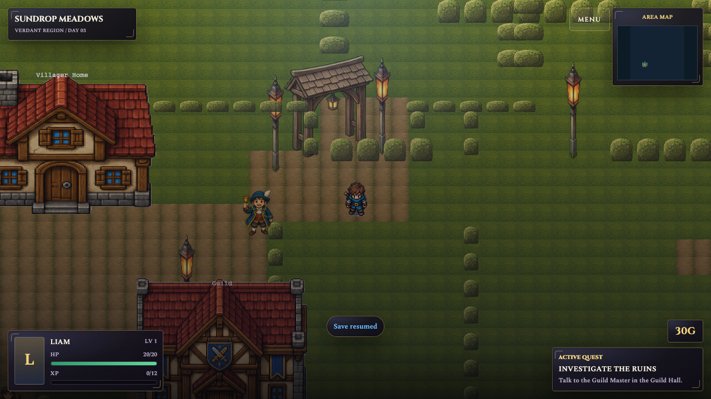

# Sundrop Layered Village — Visual Review

> HPA-132 §7. Compiled from `sundropVillageLayered` via `compileLayeredRegion`.
> PR #12 merged to `main` at `d737d76` on 2026-07-12. PR #11 is closed as superseded.

## Game boot confirmation

The game boots successfully with the compiled village (`bun run dev`,
localhost:5173). The HUD renders (Sundrop Meadows, player status, quest tracker).
The player spawns at the meadow spawn point and the village is reachable. A fresh
visual pass used the in-app Browser for boot/menu QA and the existing Playwright
save-fixture pattern to frame each review location at 1280×720. The Browser pass
reported no console warnings or errors. The anchored captures also reported no
console errors.

## Review artifacts

| Required view | Layered artifact |
| --- | --- |
| Home Yard | [`img/layered-home-yard.png`](img/layered-home-yard.png) |
| Well Plaza | [`img/layered-well-plaza.png`](img/layered-well-plaza.png) |
| Market Yard | [`img/layered-market-yard.png`](img/layered-market-yard.png) |
| Shrine Garden | [`img/layered-shrine-garden.png`](img/layered-shrine-garden.png) |
| East Gate | [`img/layered-east-gate.png`](img/layered-east-gate.png) |
| Muted-path designer/debug view | [`img/village-layered-designer-view.svg`](img/village-layered-designer-view.svg) |

The designer view mutes path color while emphasizing collision/building cells,
region ownership, decor glyphs, and semantic object anchors. The five source
layers remain reviewable as fixed-width rows in
`src/lib/game/content/maps/regions/village-layered.ts`; the region and collision
layers are also reproduced below.

### Current layered views







## Side-by-side comparison with PR #11

The PR #11 images omit the current HUD while the layered captures include it, so
these are spatial-composition comparisons rather than pixel diffs.

### Home Yard

| PR #11 coordinate layout | Layered layout |
| --- | --- |
|  |  |

### Well Plaza

| PR #11 coordinate layout | Layered layout |
| --- | --- |
|  |  |

### East Gate

| PR #11 coordinate layout | Layered layout |
| --- | --- |
|  |  |

## Visual findings and disposition

The first fresh layered capture exposed a pale checkerboard across Well Plaza.
The source legend names `c` as cobblestone, but the compiler mapped it to the
literal checkerboard `plazaStoneTile` frame. The mapping now targets
`cobblestoneTile`; compiler, map, and scene tests lock the corrected terrain
index, and the layered captures above were recaptured after the fix. The PR #11
comparison images in the side-by-side tables are historical reference captures
and were not regenerated.

Visible reductions in mess compared with PR #11:

1. **Fewer disconnected wall fragments.** Home Yard and East Gate use longer,
   continuous room boundaries with deliberate openings instead of scattered
   hedge islands communicating the route.
2. **A clearer central hub.** Well Plaza is one compact cobblestone room with a
   legible north lane and side-room mouths; the well and flower beds read as a
   single composition.
3. **More readable side pockets.** Market Yard and Shrine Garden have distinct
   silhouettes and entrances, so their caches read as optional detours rather
   than objects floating beside the main path.
4. **Less dependence on path texture.** In the muted-path designer view, wall
   gaps, room ownership, building footprints, and the gate still communicate
   `home → plaza → side rooms → east gate`.

Review questions:

- **Can the player understand the route if path textures are ignored?** Yes.
  The collision openings and landmark placement preserve the route in the
  muted-path view.
- **Does the layered village feel less messy than PR #11?** Yes, after replacing
  the checkerboard mismatch with cobblestone. The hub and side rooms read as
  fewer, larger authored spaces.
- **Does it avoid the hedge-grid look?** Mostly. Hedges remain the village wall
  vocabulary, but the important boundaries are continuous and openings are
  intentional. The sparse meadow beyond East Gate remains deliberately open.
- **Are side rewards readable as optional detours?** Yes. The market and shrine
  captures show separate rooms, while source tests keep both caches inside those
  regions and off the main route.
- **Does the map still express `home → plaza → side rooms → east gate`?** Yes.
  The screenshots, designer overlay, and collision connectivity checks agree on
  that sequence.

## Village grid

- Origin: `{ x: 240, y: 4360 }`
- Grid: 56 cols × 48 rows, tileSize 32
- Tile `(col,row)` → world center `(256 + col*32, 4376 + row*32)`

## Region layout (ASCII)

```
     0         1         2         3         4         5
     01234567890123456789012345678901234567890123456789012345
  0  ........................................................
  1  ........................................................
  2  ............................................CCCCC.......
  3  ............................................CCCCC.......
  4  ............................................CCCCC.......
  5  ........................................EEEEEEEEE.......
  6  ........................................EEEEEEEEE.......
  7  ........................................EEEEEEEEE.......
  8  ..................NNNNNNNNNNNNNNNNNNNNNNEEEEEEEEE.......
  9  ..................NNNNNNNNNNNNNNNNNNNNNNN...............
 10  ..................NNNNNNNNNNNNNNNNNNNNNNN...............
 11  ..................NNNNNNNNNNNNNNNNNNNNNNN...............
 12  ..................NNNNNNNNNNNNNNNNNNNNNNN...............
 13  ..................NNNNNNNNNNNNNNNNNNNNNNN...............
 14  ..................NNNNNNNNNNNNNNNNNNNNNNN...............
 15  ..................NNNNNNNNNNNNNNNNNNNNNNN...............
 16  ........................................................
 17  ........................................................
 18  ........................................................
 19  ........................................................
 20  ........................................................
 21  ........................................................
 22  ......MMMMMMMMMMMMMMPPPPPPPPPPPPP.......................
 23  ......MMMMMMMMMMMMMMPPPPPPPPPPPPP.......................
 24  ......MMMMMMMMMMMMMMPPPPPPPPPPPPP.......................
 25  ......MMMMMMMMMMMMMMPPPPPPPPPPPPP.......................
 26  ......MMMMMMMMMMMMMMPPPPPPPPPPPPP.......................
 27  ......MMMMMMMMMMMMMMPPPPPPPPPPPPP.......................
 28  ......MMMMMMMMMMMMMMPPPPPPPPPPPPP.......................
 29  ......MMMMMMMMMMMMMMPPPPPPPPPPPPP.......................
 30  ........................................................
 31  ........................................................
 32  ........................................................
 33  ........................................................
 34  ......................SSSSSSSSSSSSSSSSSSS...............
 35  ......................SSSSSSSSSSSSSSSSSSS...............
 36  ......HHHHHHHHHHHHHHH.SSSSSSSSSSSSSSSSSSS...............
 37  ......HHHHHHHHHHHHHHH.SSSSSSSSSSSSSSSSSSS...............
 38  ......HHHHHHHHHHHHHHH.SSSSSSSSSSSSSSSSSSS...............
 39  ......HHHHHHHHHHHHHHH.SSSSSSSSSSSSSSSSSSS...............
 40  ......HHHHHHHHHHHHHHH.SSSSSSSSSSSSSSSSSSSS..............
 41  ......HHHHHHHHHHHHHHH.SSSSSSSSSSSSSSSSSSS...............
 42  ......HHHHHHHHHHHHHHH.SSSSSSSSSSSSSSSSSSS...............
 43  ......................SSSSSSSSSSSSSSSSSSS...............
 44  ........................................................
 45  ........................................................
 46  ........................................................
 47  ........................................................
```

Room key: **H** Home Yard · **P** Well Plaza · **M** Market Yard ·
**N** North Residences · **S** Shrine Garden · **E** East Gate ·
**C** Crossroads exit corridor.

## Collision layout (ASCII)

`` '#' = garden-hedge wall, '.' = walkable ``

```
     0         1         2         3         4         5
     01234567890123456789012345678901234567890123456789012345
  2  ..#########################################......#######
  3  ..#........................................#.....#..#...
  4  ..#........................................#.....#..#...
  5  ..#.....................................................
  6  ..#.....................................................
  7  ..#.....................................................
  8  ..#.....................................................
  9  ..#......................................#..........#...
 10  ..#......................................#..........#...
 11  ..#......................................#..........#...
 12  ..#......................................#..........#...
 13  ..#......................................#..........#...
 14  ..#......................................#..........#...
 15  ..#......................................#..........#...
 16  ..#.....................#...#............#..........#...
 17  ..#.....................#...#............#..........#...
 18  ..#.....................#...#............#..........#...
 19  ..#.....................#...#............#..........#...
 20  ..#.....................#...#............#..........#...
 21  ..#.................#####...#####........#..........#...
 22  ..#................#................................#...
 23  ..#................#................................#...
 24  ..#................#................................#...
 25  ..#.................................................#...
 26  ..#.................................................#...
 27  ..#................#................................#...
 28  ..#................#................................#...
 29  ..#................#................................#...
 30  ..#..........#...#...####...#####...................#...
 31  ..#..........#...#......#...#.......................#...
 32  ..#..........#...#......#...#.......................#...
 33  ..#..........#...#......#...#.......................#...
 34  ..#..........#.......#..............................#...
 35  ..#..........#...#...#..............................#...
 36  ..#.................................................#...
 37  ..#.................................................#...
 38  ..#.................................................#...
 39  ..#..................#..............................#...
 40  ..#..................#..............................#...
 41  ..#..................#..............................#...
 42  ..#..................#..............................#...
 43  ..#.................................................#...
 44  ..#.................................................#...
 45  ..###################################################...
```

Doorways (gaps in walls):
- M↔P: col 19, rows 25-26 (between Market Yard and Well Plaza)
- P north mouth: cols 25-27, row 21 (Plaza → North lane)
- P south mouth: cols 25-27, row 30 (Plaza → Shrine connector)
- H↔S: col 21, rows 36-38 (Home Yard ↔ Shrine Garden)
- North gate exit: cols 44-48, rows 2-4 (village → corridor → crossroads)

## Object placement

| Object | col | row | World center |
|--------|-----|-----|-------------|
| hero-house-exterior | 14 | 33 | (704, 5432) |
| item-shop-exterior | 8 | 18 | (512, 4952) |
| blacksmith | 4 | 28 | (384, 5272) |
| villager-house-1-exterior | 19 | 3 | (864, 4472) |
| villager-house-2-exterior | 29 | 4 | (1184, 4504) |
| guild-hall-exterior | 38 | 16 | (1472, 4888) |
| sundrop-well | 23 | 25 | (992, 5176) |
| shrine-of-aurora | 29 | 37 | (1184, 5560) |
| villager-house-3-exterior | 40 | 31 | (1536, 5368) |

Transitions (doorways) at tiles adjacent to each landmark.
Pickups: village-market-cache (11,27), village-shrine-cache (41,40).
Ambient NPCs: wanderer (26,19), woodcutter (10,28), pilgrim (26,43), crier (40,8).

## Spatial adjustments during Task 8

1. villager-house-1/2 moved south (row 1 → rows 3/4) to satisfy village-cluster bounds.
2. village-market-cache moved (5,31 → 11,27) — was inside blacksmith landmark rect.
3. autumnMaple decor moved (row 34 → 35) — collision was sealing villager-house-3 transition.
4. Three collision cells opened (col 17 row 34, col 43 row 2, col 20 row 30) for critical-route clearance.
5. village-wanderer moved (col 28 → 26) — was inside a hedge wall.

## Test results

Fresh validation on 2026-07-12 after the cobblestone correction:

| Gate | Result |
|------|--------|
| `bun run test:unit -- --run` | 638 passed (43 files) |
| `bun run check` | 0 errors, 0 warnings |
| `bun run lint` | clean (prettier + eslint) |
| `bun run test:e2e` | 12 passed |
| village-layered.test.ts (connectivity + guard) | 16 passed |
| compile-layered-region.test.ts | 29 passed |

The first full-suite retry hit the existing 5-second dynamic-import timeout in
`createGame.test.ts` under concurrent browser load. The isolated test passed in
532 ms, and the final full suite passed after the capture/dev server was stopped.

## Review checklist

- [x] Home Yard, Well Plaza, Market Yard, Shrine Garden, and East Gate render in-game.
- [x] No missing asset/frame errors were emitted during boot or anchored captures.
- [x] Fountain, lanterns, market stall, maple, and gate arch have readable placements.
- [x] Hedge walls form coherent room boundaries with visible route openings.
- [x] Source-level BFS and compiled map tests cover Home Yard → Plaza → Market / North / Shrine / East Gate connectivity.
- [x] PR #12 merged and PR #11 was closed with a superseding reference.

Residual risk: the anchored screenshots are not a continuous manual controller
walkthrough. Route reachability and doorway geometry are covered by automated
source/map tests, and the complete Playwright suite boots and exercises the
current game, but a future art-polish pass could still benefit from a human
controller walkthrough at native desktop scale.
